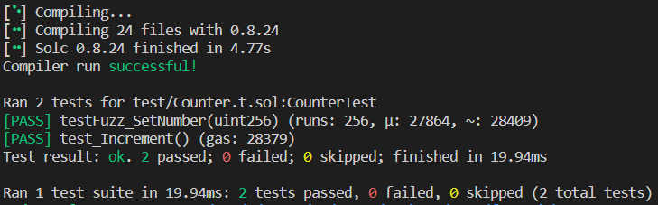
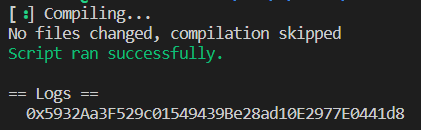
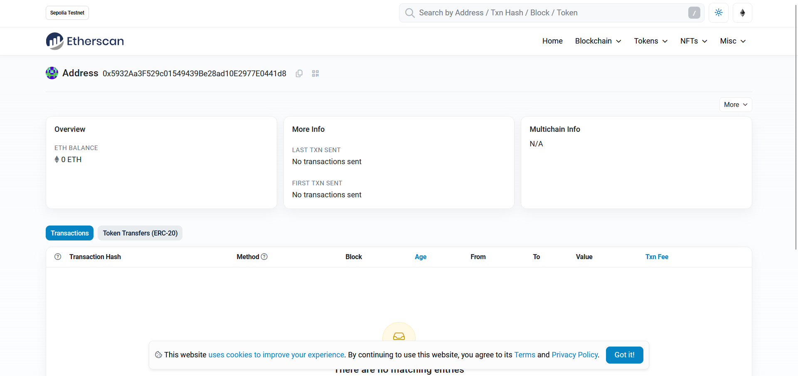

# 2024-Spring-HW0

All the detailed specified in Homework 0 documentation.

## Wallet Address
Please provide your MetaMask wallet address: \
MetaMask wallet address (feel free to donate plz): `0x5c9ce6944Fd488a33f437e86d85f1b496CdEeE9e`.

## Local Testing
Please provide a screenshot of the `forge test -vvv` command running in your local environment.

## Contract Address
Please provide the contract address that you deployed on the Sepolia network. \
Contract address: `0x5932Aa3F529c01549439Be28ad10E2977E0441d8`

## Sepolia Etherscan
Paste the contract address into the Sepolia Etherscan and share the screenshot. \
[Result of TESTNET Sepolia - Etherscan](https://sepolia.etherscan.io/address/0x5932Aa3F529c01549439Be28ad10E2977E0441d8)
